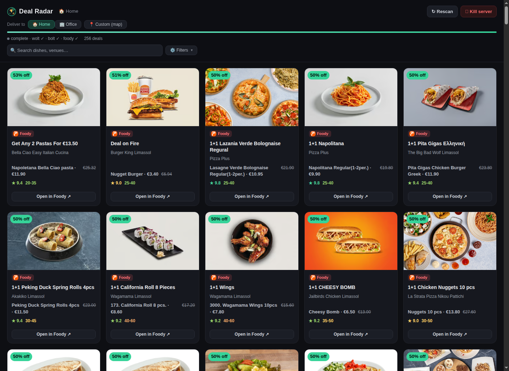
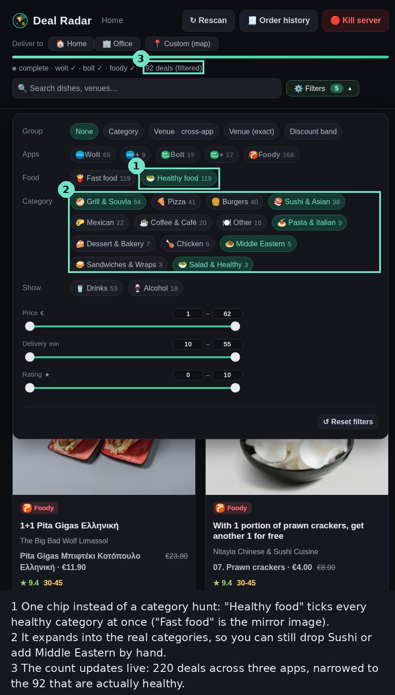
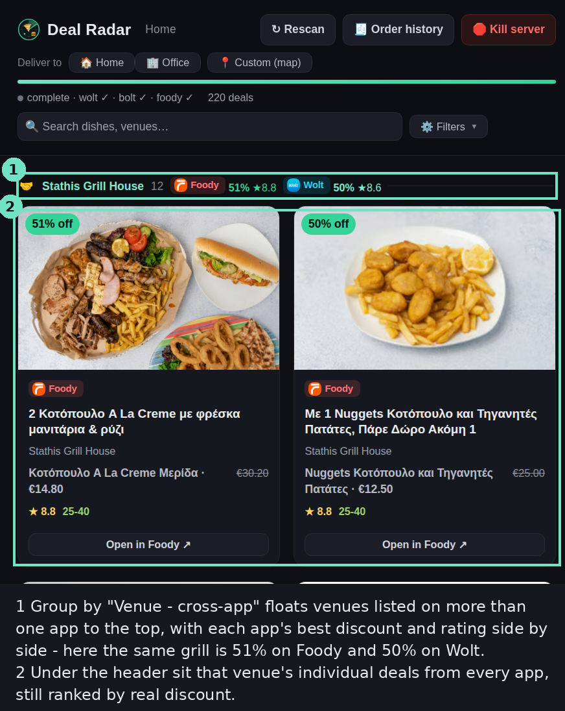

# deal-radar

Three food-delivery apps, one page of what is actually discounted near you.



Wolt, Bolt Food and Foody each bury their promos behind a different screen, and
the venue badges oversell: "up to 50% off" usually means one coffee is half
price. deal-radar goes down to the item level — the real dish, the real price —
scans all three apps at once and ranks what comes back by how big the discount
actually is.

It runs on your machine and talks to the same private endpoints the apps' own
web clients use, with your session tokens. No server, nothing leaves the box.

## Setup

Node 18+. No dependencies.

```bash
git clone <this repo> ~/deal-radar && cd ~/deal-radar
```

None of these apps has a public API, so there is no API key to issue yourself.
What you do instead is lift the credentials your own browser is already using.
Same pattern for all three:

```bash
node bin/capture.mjs wolt          # prints the steps + a console snippet
# …run it in the browser, it copies to your clipboard…
node bin/import-tokens.mjs wolt '<paste>'
```

`capture.mjs` prints the snippet; `import-tokens.mjs` validates the paste and
writes it to `~/.config/deal-radar/<provider>_auth.json`, `chmod 600`. Nothing
lands in the repo.

**Do the capture in a private / incognito window.** A browser keeps one session
per site, so logging in again elsewhere to grab a token can invalidate the one
you already saved — and ordinary browsing in that same tab rotates tokens under
you. Incognito gives the capture its own session; close it when you're done.

Wolt is the one that carries most of the weight, so start there. After importing:

```bash
node bin/set-address.mjs --auto    # which saved address is the default target
```

Its access token lasts ~30 minutes and renews itself; the refresh token lasts
months. When that finally dies the scanner says so and you re-capture.

**Bolt** (`node bin/capture.mjs bolt`) — browse to your city first, so the URL
looks like `/en/<city>/…`. The snippet reads the refresh token out of Bolt's
obfuscated localStorage blob *and* the city slug out of that URL, which is what
venue links are built from. If you were on the home page it'll say so; pass
`--city <slug>` yourself in that case. The token is good for about a year.

**Foody** (`node bin/capture.mjs foody`) — there is no token here at all; the
credential is one logged-in session's `x-core-*` headers. The snippet hooks
`fetch`/`XHR`, waits for the page to make its own API call, then pops a green
button that copies the whole thing. If no button shows up, click a Sorting
option or a category — not a restaurant — to make the page fire a request. The
import refuses a paste without `x-core-session-id`, because a guest session
silently hides every Foody+ deal. Expect to redo this one occasionally.

Delivery-address buttons come from your Wolt address book by default. To label
them yourself, drop a `places.json` next to the auth files — see
`config/places.example.json`.

## Use

```bash
node scripts/serve.mjs --address Home      # → http://localhost:8765
```

That is the whole thing: it scans all three providers in parallel, streams cards
in as venues come back, then settles on the ranked set.

One menu holds the filters — apps and their subscription tiers (W+/Bolt+/F+),
food categories, price, delivery time, rating, and the drinks/alcohol toggles
that are off by default because a €249 brandy is not lunch. What you pick sticks
in the browser.



Grouping by venue across apps floats the venues listed on more than one app to
the top, with each app's best discount and rating side by side:



Rescan without restarting (↻), or point it somewhere else by dragging a pin on
the map. The server stops itself after an hour.

There is a text mode too, for when you just want the list:

```bash
node scripts/deals.mjs --address Home --limit 20
node scripts/bolt.mjs --json
node scripts/foody.mjs --json
```

`node scripts/deals.mjs --help`-worthy flags are documented in `SKILL.md`, along
with the scanner internals.

And a picture mode, if you'd rather send someone the deals than describe them:

```bash
npm i puppeteer                                        # the only optional dep
node scripts/screenshots.mjs --address Home --top 10
```

That opens each venue's page logged in, outlines every proposed item with its
rank and discount, and tiles the shots into one grid (via ImageMagick's
`montage`). It can post the grid to Telegram if you give it a bot token and chat
id — `--token`/`--chat-id`, the `TELEGRAM_BOT_TOKEN`/`TELEGRAM_CHAT_ID`
environment variables, or `telegram.json` next to the auth files.

## Your own order history

The same Wolt session that finds deals can also hand back everything you have
ever ordered — which the app itself will only show you fifty at a time, one
order per screen, with no export.

```bash
node scripts/wolt-history.mjs        # → ~/.config/deal-radar/order-history/
```

You get one `wolt_history.json` holding every order with its full detail — the
basket with per-item prices and options, discounts, fees, tips, the venue, the
delivery distance and time — plus a per-order cache that makes the next run
incremental. Group orders keep each participant's items and share, so a dinner
for six is still six baskets rather than one anonymous total.

The report has a page for it (**🧾 Order history**, or `/history`): search and
sort your orders, expand one to see the basket split by person, the fee
breakdown, what card paid for it, and the order's untouched JSON. The **⇩
Export** button runs the exporter from the browser and streams its progress into
the status bar. Nothing is trimmed on the way to the page — it is handed the
export exactly as saved.

These endpoints are throttled much harder than the ones the scanner uses, so the
export paces itself adaptively rather than at a fixed rate — a thousand orders
takes about half an hour the first time and seconds thereafter.

## How it finds things

Wolt's own "promotions near you" endpoint is fast but thin, so the scanner
treats it as a seed list and then fetches the assortment of every promoted venue
plus the closest ~100 others, looking for items whose original price beats their
current one. Badge texts that aren't a clean percentage ("Buy 2 pay 1", "€5 off
over €25") go through a parser; whatever it can't read gets logged to
`~/.config/deal-radar/unparsed_promos.jsonl` so the rules can be extended.

Non-food is filtered twice — first by the venue's vertical (restaurants only),
then by item name — both driven by `banlist.json`.

Wolt's API tops out around 6.6 requests/second no matter how much concurrency
you throw at it, so every request goes through a global rate gate. A full scan
of ~180 venues takes roughly a minute and a half.

## As a Claude Code skill

`SKILL.md` at the repo root makes this loadable as a skill — clone into
`~/.claude/skills-available/` and symlink it into `~/.claude/skills/`. Then
"find me a lunch deal" launches the report.

## Caveats

None of these APIs are public. They change without warning, and this will break
when they do. Rate limits are real — don't raise `--scan-rps`. Foody is
Cyprus-only. Bolt only exposes venue-level discounts (its item-level menu
endpoint needs an auth path that isn't captured here yet). The map picker pulls
Leaflet and tiles from a CDN, so that part needs internet beyond the delivery
APIs.
